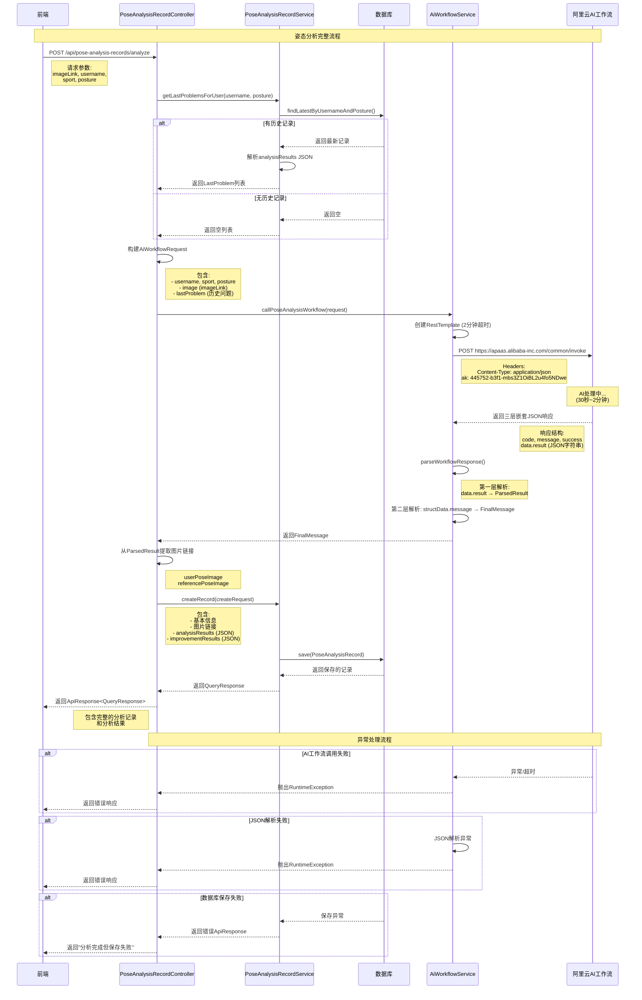

# 姿态分析功能时序图和详细说明

## 时序图



## 详细文字说明

### 1. 请求接收阶段
**步骤**: 前端 → PoseAnalysisRecordController
- **触发**: 用户点击"开始姿态分析"按钮
- **请求路径**: `POST /api/pose-analysis-records/analyze`
- **请求参数**: 
  ```json
  {
    "imageLink": "http://example.com/user-pose.jpg",
    "username": "张三",
    "sport": "YOGA", 
    "posture": "Downward Dog"
  }
  ```
- **验证**: Spring Validation自动验证参数完整性

### 2. 历史记录查询阶段
**步骤**: PoseAnalysisRecordController → PoseAnalysisRecordService → Database
- **目的**: 获取用户该姿势的上一次分析问题，作为AI工作流的`lastProblem`参数
- **查询逻辑**: 
  - 按`username`和`posture`查询最新记录
  - 如果存在记录，解析`analysisResults`字段（JSON数组）
  - 提取每个分析结果的`problem`和`suggestion`字段
  - 构建`LastProblem`对象列表
- **容错处理**: 
  - 无历史记录时返回空列表
  - JSON解析失败时返回空列表
  - 不影响主流程继续执行

### 3. AI工作流请求构建阶段
**步骤**: PoseAnalysisRecordController内部处理
- **构建参数**:
  ```json
  {
    "apiCode": "360000000003870008",
    "stream": false,
    "paramJson": {
      "username": "张三",
      "sport": "YOGA",
      "posture": "Downward Dog", 
      "image": "http://example.com/user-pose.jpg",
      "lastProblem": [
        {
          "problem": "膝盖内扣",
          "suggestion": "下蹲时确保双膝与脚尖方向一致"
        }
      ]
    }
  }
  ```

### 4. AI工作流调用阶段
**步骤**: AiWorkflowService → 阿里云AI工作流
- **HTTP配置**:
  - URL: `https://apaas.alibaba-inc.com/common/invoke`
  - Method: POST
  - Headers: `Content-Type: application/json`, `ak: 445752-b3f1-mbs3Z1OiBL2u4fo5NDwe`
  - 超时设置: 连接超时和读取超时均为2分钟
- **处理时间**: 30秒到2分钟不等
- **响应格式**: 
  ```json
  {
    "code": 200,
    "message": "success", 
    "success": true,
    "data": {
      "result": "{JSON字符串}"
    }
  }
  ```

### 5. 响应解析阶段
**步骤**: AiWorkflowService内部处理
- **三层解析过程**:
  
  **第一层**: 外层响应 → `data.result`字符串
  ```json
  {
    "data": {
      "message": [],
      "structData": {
        "userPoseImage": "图片链接",
        "referencePoseImage": "图片链接", 
        "message": "{JSON字符串}"
      }
    }
  }
  ```
  
  **第二层**: `structData.message`字符串 → 最终分析结果
  ```json
  {
    "success": true,
    "overallScore": 85,
    "analysisResults": [
      {
        "problem": "膝盖内扣",
        "suggestion": "下蹲时确保双膝与脚尖方向一致",
        "isLastProblem": false
      }
    ],
    "improvementResults": [
      {
        "problem": "腰部过度前凸", 
        "evaluation": "骨盆倾角明显改善"
      }
    ]
  }
  ```

### 6. 数据存储阶段
**步骤**: PoseAnalysisRecordController → PoseAnalysisRecordService → Database
- **存储内容**:
  - 基本信息: username, sport, posture
  - 图片链接: userPoseImage, referencePoseImage (从AI响应中提取)
  - 分析结果: analysisResults (JSON字符串格式)
  - 改进结果: improvementResults (JSON字符串格式)
  - 时间戳: createdAt, updatedAt (自动生成)

### 7. 响应返回阶段
**步骤**: PoseAnalysisRecordController → 前端
- **成功响应**:
  ```json
  {
    "result": "SUCCESS",
    "message": "姿态分析完成",
    "data": {
      "id": 123,
      "username": "张三",
      "sport": "YOGA",
      "posture": "Downward Dog",
      "userPoseImage": "用户姿势图片链接",
      "referencePoseImage": "参考姿势图片链接", 
      "analysisResults": "[{...}]",
      "improvementResults": "[{...}]",
      "createdAt": 1632150000000,
      "updatedAt": 1632150000000
    }
  }
  ```

## 异常处理机制

### 1. AI工作流调用异常
- **场景**: 网络超时、API密钥错误、服务不可用
- **处理**: 捕获异常，返回错误响应，记录详细日志
- **用户体验**: 显示"姿态分析失败"消息

### 2. JSON解析异常  
- **场景**: AI返回格式不符合预期、字段缺失
- **处理**: 捕获解析异常，返回错误响应
- **用户体验**: 显示"分析结果解析失败"消息

### 3. 数据库操作异常
- **场景**: 数据库连接失败、字段约束违反
- **处理**: 返回"分析完成但保存失败"消息
- **用户体验**: 分析结果已获得，但未保存到历史记录

### 4. 历史记录查询异常
- **场景**: 数据库查询失败、JSON解析错误
- **处理**: 返回空的lastProblem列表，继续主流程
- **用户体验**: 不影响当前分析，只是没有历史问题参考

## 关键设计决策

### 1. 容错设计
- 历史记录查询失败不影响主流程
- 使用空列表作为默认的lastProblem值
- 详细的异常日志便于问题排查

### 2. 性能优化
- 2分钟超时设置适应AI处理时间
- 异步处理可能的优化点（当前为同步）
- 数据库查询优化（按时间倒序，取最新一条）

### 3. 数据一致性
- 使用事务确保数据完整性
- JSON格式存储便于后续扩展
- 时间戳自动管理

请检查这个实现逻辑是否符合您的预期，有任何问题或需要调整的地方请告诉我！
